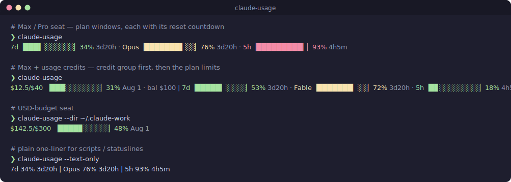
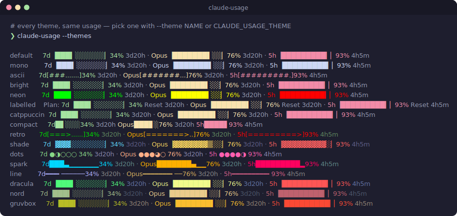

# claude-usage

Your Claude account's spend / rate-limit usage in the terminal — **straight from
Anthropic's own server-side counter**, not from parsing local transcripts.

<p align="center">
  
</p>

(The image is genuine renderer output — `tools/generate-readme-svg.zsh` seeds
demo caches, runs `claude-usage`, and converts the ANSI colours to SVG.)

`claude-usage` reads the same OAuth usage endpoint that
claude.ai → Settings → Usage shows, so it reports **all** usage billed to the
account — Claude Code on any machine *plus* claude.ai — unlike transcript-based
tools (e.g. ccusage) that only see the box they run on. It works for all three
plan shapes:

- **USD-budget seats** render `$300.04/$300 ▕████▏100%`
- **Max / Pro seats** render their 7d / per-model / 5h rate-limit windows, each
  with its reset countdown (`7d▕██░░▏20% 3d21h`; the 5h window's countdown
  trails the line). All countdowns share one style — bare by default, or
  labelled via `--reset-prefix 'Reset '`.
- **Max / Pro + usage credits** (the overflow budget that kicks in when you hit
  a plan limit) render both: the dollar group leads, then the plan windows —
  `$0/$40 ▕░░░░▏0% Aug 1 | 7d▕██░░▏20% 3d21h · 5h▕████▉▏49% 1h8m`. The
  two groups are different mechanisms, so a distinct group separator sits
  between them (`" || "` text, dimmed `" | "` pretty — override with
  `--group-sep`). Toggling credits off on the usage page drops the dollar
  group again.

Each piece is individually configurable: `--show-spend=false` hides the
monthly cap (`$0/$40`), `--show-balance=false` hides the purchased-credit
balance (`bal $100` — rendered whenever the API reports `spend.balance`; the
field is null server-side so far), `--show-spend-reset=false` drops the
monthly cap's reset date (`Aug 1` — derived locally as the 1st of next month,
since the API doesn't report it), and `--show-limit-resets=false` drops the
per-window countdowns on the 7d/model limits.

It's built to be embedded in an always-on statusline: bare calls **never block**
— they return instantly from a cache and revalidate in a detached background
process with stale-while-revalidate semantics, lock-guarded fetches, and failure
backoff. (The companion [claude-statusline](https://github.com/deviationist/claude-statusline)
project renders this inside a Claude Code status line.)

## Install

Requirements: `zsh`, `jq`, `curl`.

```sh
git clone https://github.com/deviationist/claude-usage.git ~/code/claude-usage
```

Source it from `~/.zshrc`:

```sh
source ~/code/claude-usage/claude-usage.zsh
```

That defines the `claude-usage` shell function. (It's a zsh function, so it must
be *sourced* — it isn't an executable on `PATH`.)

## Usage

```
claude-usage                          # colour progress bars (default, --pretty)
claude-usage --text-only              # plain one-liner, no bars/colour
claude-usage --theme labelled         # pick a preset (--list-themes for names)
claude-usage --no-color               # keep the bars, drop all colour
claude-usage --list-themes            # print the built-in preset names
claude-usage --themes                 # preview: render your usage once per theme
claude-usage --json                   # machine-readable summary for scripts
claude-usage --raw                    # full untouched endpoint response
claude-usage --fresh                  # blocking refresh, guaranteed current
claude-usage --no-block               # statusline mode: never blocks, silent on cold/broken state
claude-usage --dir PATH               # another account's Claude config dir
claude-usage --sep ' / '              # custom metric delimiter (both modes)
claude-usage --show-reset=false       # drop the 5h reset countdown
claude-usage --show-spend=false       # hide the monthly $-cap segment (combined view)
claude-usage --show-balance=false     # hide the credit-balance segment
claude-usage --show-spend-reset=false # drop the monthly-cap reset date
claude-usage --show-limit-resets=false # drop the 7d/model reset countdowns
claude-usage --reset-prefix 'Reset '  # label every reset — countdowns and the
                                      # monthly-cap date (default: bare)
claude-usage --spend-prefix 'Credit: '     # label before the dollar group
claude-usage --limits-prefix 'Plan usage: ' # label before the plan limits
claude-usage --group-sep ' >> '       # $-group / plan-limit separator
claude-usage --version                # print version and exit
```

`--pretty` respects the [`NO_COLOR`](https://no-color.org) convention: set
`NO_COLOR` to any non-empty value and colour is suppressed (bars kept), same as
`--no-color`.

Both `--pretty` and `--text-only` order the metrics with the 5h window last
(next to the reset countdown).

## Theming

A theme is a **full-config preset**: colours and glyphs for the `--pretty`
bars, plus optional layout defaults — separators, section/reset prefixes, bar
width — that apply to both output modes. Pick one with `--theme NAME` (or
`CLAUDE_USAGE_THEME`, including in the config file); `--list-themes` prints
the names.

Preview them all against your own live usage with `claude-usage --themes`:

<p align="center">
  
</p>

| Theme | Look |
|---|---|
| `default` | green / amber / red, unicode eighth-block bars (`▕██▊░░▏`) |
| `mono` | no colour, same unicode bars (separators stay faint) |
| `ascii` | colour + ASCII glyphs (`[##....]`) — for fonts without block chars |
| `bright` | bright ANSI colours, unicode bars |
| `neon` | vivid 256-colour, unicode bars |
| `retro` | arcade loading bar `[====>.....]` in CRT phosphor (green tube → amber → alarm red) |
| `shade` | DOS shade blocks `▕▓▓▓▒░░░░░░▏` on ice (cyan → gold → salmon) |
| `dots` | dot meter, 5 wide, candy pastels: `●●◑○○` (mint → peach → hot pink) |
| `spark` | sparkline ramp rising from a baseline, electric: `██▅▁▁▁▁▁▁▁` (cyan → orange → hot red) |
| `line` | slim gauge, understated: `━━━╸───────` (periwinkle → gold → rose) |
| `labelled` | default look + section/reset labels: `Credit: $0/$40 ▕░░▏0% Reset Aug 1 \| Plan: 7d▕██▏53% Reset 3d20h …` |
| `catppuccin` | truecolor [Catppuccin Mocha](https://catppuccin.com) — the palette from the screenshot above |
| `dracula` | truecolor [Dracula](https://draculatheme.com) palette |
| `nord` | truecolor [Nord](https://nordtheme.com) palette |
| `gruvbox` | truecolor [Gruvbox](https://github.com/morhetz/gruvbox) palette |
| `compact` | tightest statusline fit: 5-cell bars, no brackets, single-space separators |

A theme only fills settings you haven't chosen yourself — any explicit value
(flag, env var, or config file) beats the theme. So `--theme labelled
--limits-prefix 'Usage: '` keeps the theme's `Credit:` label but swaps `Plan:`
for `Usage: `.

`--no-color` drops colour from *any* theme while keeping the bars (unlike
`--text-only`, which drops the bars too).

For finer control, these env vars override individual fields **on top of** the
chosen theme:

| Variable | Format | Example |
|---|---|---|
| `CLAUDE_USAGE_COLORS` | `low:mid:high` SGR params (`""` = no colour) | `92:93:91` or `38;5;46:38;5;226:38;5;196` |
| `CLAUDE_USAGE_THRESHOLDS` | `amber:red` fill breakpoints | `70:90` |
| `CLAUDE_USAGE_BAR_CHARS` | `full:partial:empty` glyphs (partial is a low→high ramp, may be empty) | `#::.` |
| `CLAUDE_USAGE_BRACKETS` | `left:right` bar frame (`:` = none) | `[:]` |
| `CLAUDE_USAGE_DIM` | SGR for separators/reset (`""` = none) | `2` |

Example — a monochrome, ASCII-framed bar for a limited terminal:

```sh
CLAUDE_USAGE_BAR_CHARS='#::.' CLAUDE_USAGE_BRACKETS='[:]' claude-usage --no-color
```

## Accounts & tokens

Account resolution: `--dir` > `$CLAUDE_USAGE_DIR` > `$CLAUDE_CONFIG_DIR` >
`~/.claude`.

The OAuth token is read from `<dir>/.credentials.json` or, on macOS, the
Keychain entry Claude Code itself maintains. Multi-account setups are handled:
the Keychain service is namespaced per config dir
(`Claude Code-credentials-<first 8 hex of sha256(absolute dir path)>`), and the
freshest non-expired token across all sources wins. Nothing is ever written to
those stores — `claude-usage` only reads the token Claude Code already keeps
locally, and talks only to the standard Anthropic API host.

## Caching

Per account, under `$TMPDIR` (the cache file is derived from the config dir, so
multiple accounts never clobber each other). Bare invocations return
immediately from cache; if the cache is older than the TTL, a detached
background refresh runs and the **next** call sees the new value. Failed
refreshes never destroy the last known value and back off for 60s, so a
constantly-repainting statusline can't hammer the endpoint.

## Config file

Every `CLAUDE_USAGE_*` variable below can also live in
`~/.config/claude-usage/config` (override the path with `CLAUDE_USAGE_CONFIG`)
as plain `NAME=value` lines — quotes around the value optional, `#` comments
allowed:

```sh
CLAUDE_USAGE_RESET_PREFIX="Reset "
CLAUDE_USAGE_SPEND_PREFIX="Credit: "
CLAUDE_USAGE_LIMITS_PREFIX="Plan usage: "
```

The function reads this file itself on every invocation, in **any** process —
which is the reliable way to configure statusline rendering: a statusline
repaint runs in a subprocess that never sees your interactive shell's
un-exported variables, but it always reads this file. Values are scoped to the
function (nothing leaks into your shell). Precedence: flags > config file >
process env.

## Environment variables

| Variable | Default | Meaning |
|---|---|---|
| `CLAUDE_USAGE_DIR` | `~/.claude` | Default account config dir (overridden by `--dir`). |
| `CLAUDE_USAGE_SHOW_SPEND` | `true` | Default for `--show-spend` (monthly $-cap segment in the combined view). |
| `CLAUDE_USAGE_SHOW_BALANCE` | `true` | Default for `--show-balance` (credit-balance segment, when the API reports one). |
| `CLAUDE_USAGE_SHOW_SPEND_RESET` | `true` | Default for `--show-spend-reset` (monthly-cap reset date, derived locally). |
| `CLAUDE_USAGE_SHOW_LIMIT_RESETS` | `true` | Default for `--show-limit-resets` (7d/model per-window reset countdowns). |
| `CLAUDE_USAGE_GROUP_SEP` | per-mode | Separator between the dollar group and the plan limits (`" \|\| "` text, `" \| "` pretty by default). |
| `CLAUDE_USAGE_RESET_PREFIX` | `""` | Default for `--reset-prefix` — label put before every reset: window countdowns and the monthly-cap date (e.g. `"Reset "`). |
| `CLAUDE_USAGE_SPEND_PREFIX` | `""` | Default for `--spend-prefix` — label before the dollar group (e.g. `"Credit: "`; dimmed in pretty). |
| `CLAUDE_USAGE_LIMITS_PREFIX` | `""` | Default for `--limits-prefix` — label before the plan limits (e.g. `"Plan usage: "`; dimmed in pretty). |
| `CLAUDE_USAGE_TTL` | `120` | Cache max age (seconds) before a background refresh is triggered. |
| `CLAUDE_USAGE_BAR_WIDTH` | `10` | Cells per bar in `--pretty`. |
| `CLAUDE_USAGE_SEP` | per-mode | Metric delimiter for both modes (`" \| "` text, `" · "` pretty by default). |
| `CLAUDE_USAGE_DIVISOR` | `100` | Credits→dollars divisor (100 = the API's cents) for legacy USD schemas. |
| `CLAUDE_USAGE_THEME` | `default` | `--pretty` preset: `default` / `mono` / `ascii` / `bright` / `neon` (see [Theming](#theming)). |
| `CLAUDE_USAGE_COLORS` | per-theme | `low:mid:high` fill-colour SGR params (`""` = no colour). |
| `CLAUDE_USAGE_THRESHOLDS` | `70:90` | `amber:red` fill breakpoints. |
| `CLAUDE_USAGE_BAR_CHARS` | per-theme | `full:partial:empty` bar glyphs (partial ramp may be empty). |
| `CLAUDE_USAGE_BRACKETS` | per-theme | `left:right` bar frame (`:` = none). |
| `CLAUDE_USAGE_DIM` | `2` | SGR for separators / reset countdown (`""` = none). |

## Caveats

- The usage endpoint (`api.anthropic.com/api/oauth/usage`) is **undocumented**
  and was reverse-engineered from Claude Code's own traffic. It may change or
  disappear without notice.
- Keep the TTL sane — hammering the endpoint gets rate-limited. The defaults are
  tuned for a statusline that repaints often.

## Development

```sh
zsh -n claude-usage.zsh              # syntax check
zsh test/run.zsh                     # test suite (hermetic — no network)
zsh tools/generate-readme-svg.zsh    # regenerate the README demo + themes SVGs
```

The SVGs are genuine renderer output (seeded caches, ANSI → SVG, truecolor
passthrough + xterm-256 cube math). The generator embeds the version + a
random hash in the filenames and rewrites the README's `` references —
commit all three. Regenerate whenever the themes or the renderers change.

The tests seed a fresh cache for a throwaway account dir and assert against the
rendered output, so they never touch the network or your real credentials. CI
runs the same on every push/PR. See [AGENTS.md](AGENTS.md) for the internals.

## License

MIT — see [LICENSE](LICENSE).
